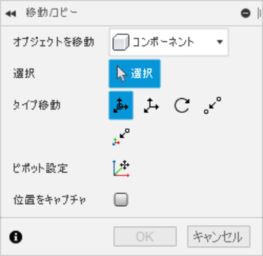

# アセンブリ
InventorでのアセンブリとFusionでのアセンブリは全くことなるため，かなり工夫してアセンブリをする必要がある。
Fusionのアセンブリでは大きく分けて，コンポーネントの移動と固定の２種類がある。移動では「移動/コピー」，「位置合わせ」があり，固定では「固定」「ジョイント」「剛性グループ」がある。それぞれ雑に紹介していく。

## 移動/コピー
修正＞移動/コピーにあるこの機能は，コンポーネントなどをXYZに何ミリ移動させるか指定できる。

また，移動させた後は位置をキャプチャしなければならない。「位置をキャプチャ」は一時的にその位置を仮固定しておくような機能である。

## 位置合わせ
修正>位置合わせにあるこの機能は，既に固定されているものや原点（座標平面など）との位置をあわせる際に使う。特に座標平面との位置関係をしていするためにはこの機能が重要になってくる。合わせた後は移動と同じように，位置をキャプチャする必要がある。（位置をキャプチャにチェックを入れるのでも良い）

## 固定
ほとんどInventorと同じ。デザイン内で固定する際にコンポーネントを右クリックして「固定」を押すと固定できる。しかし，固定した状態でデザインを他のデザインに挿入すると固定されていないことになるため，その場合は剛性グループを使用する必要がある。

## ジョイント
Inventorのものと似ている。位置合わせは位置をキャプチャしてもドラッグで動かすことができるが，ジョイントは拘束される
。

## 剛性グループ
これはコンポーネント間の位置関係を固定するのに最も手っ取り早いものである。複数のコンポーネントを選択して剛性グループでまとめると，他のデザインに挿入したときでも位置関係が固定されているようになる。

他にもたくさん機能があると思うが，現在研究中。