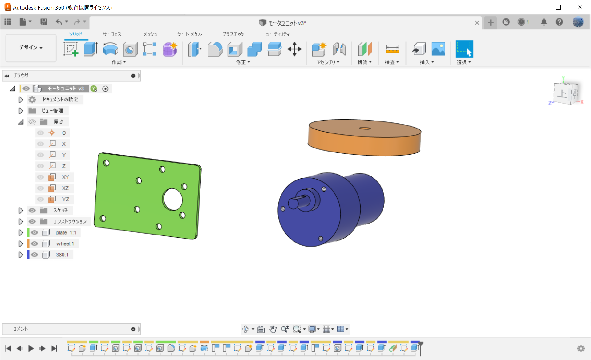
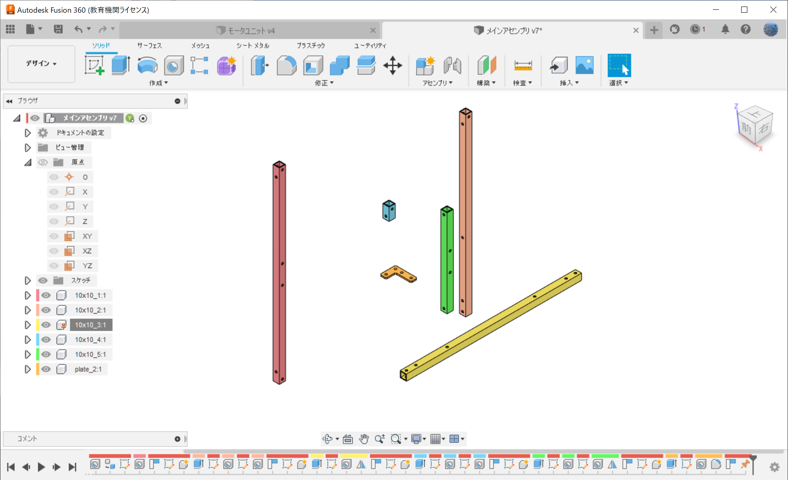
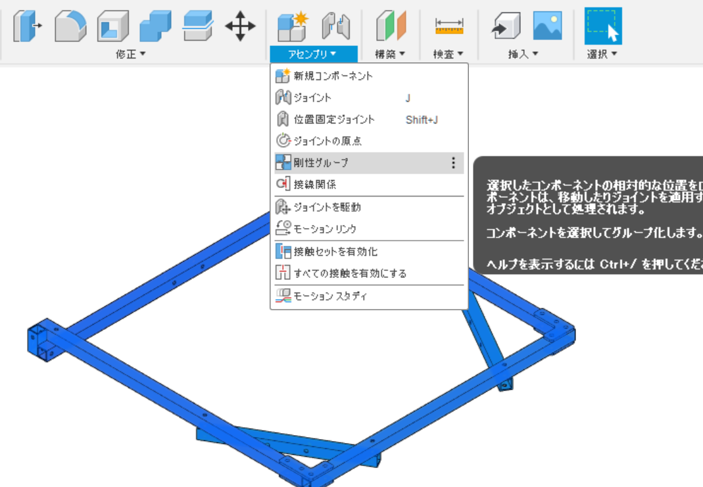
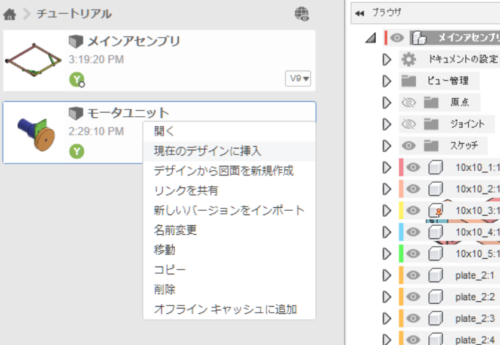

# チュートリアル
自分がやってきたInventorのCAD講習をもとに同じものを目指してFusionでも作る方法。基本的なことは省略して書いてる。

## 目次
1. デザイン1
2. デザイン2
3. デザイン1をインポート

## 1. デザイン1
まず，新規デザインを開き「モーターユニット」という名前で保存する。

↓画像のような感じでフィーチャ―を作っていく。１つのパーツを作る際は，作成＞新規コンポーネントからコンポーネントを作成してからスケッチ＞押し出しを行っていく。また，デザイン内のコンポーネントを編集する際は必ずアクティブ化してから編集するようにする（今回のチュートリアルではそれができていない）。

このようにする理由は，新規コンポーネントを作成してからアクティブ化して作成されたスケッチなどはコンポーネントにスケッチデータを包括されるが，そのようにしないとコンポーネント内に作成したスケッチを含ませることができないからである。

コンポーネントをアクティブ化するには，コンポーネントの右の〇をクリックする。

続いて車輪も作っていく。コンポーネントが分かれていたら重なっていても問題ない。また，コンポーネントに関しては分かりやすい名前を付けておく。

コンポーネントが増えてくると分かりにくくなるので，検査＞コンポーネントカラーサイクルの切り替えで色分けしてくれる。

モーターまで作ったらモデリングは終わり。

アセンブリに関しては，Inventorと決定的に違うため，上手く適応していく必要がある。現状，自分のやり方としては，位置の調節として「位置合わせ」と「移動」を使用し，位置の固定として「ジョイント」と「固定」を使用している。
位置を調節して固定して形を決める。それでも自由度が残っており，簡単に固定したいときは「剛性グループ」を使う。

完成

## デザイン2
次にメインアセンブリ（デザイン）を作っていく。
１の時と同じように保存し，パーツ(コンポーネント)を作って固定していく。

複数使用するコンポーネントに関しては，作った後にコンポーネントを選択肢てCtrlC, CtrlVで複製する。

ある程度形ができたらアセンブリ＞剛性グループでひとつにする。

## デザイン1をインポート
デザイン2(メインアセンブリ)を開いた状態で，モータユニットを右クリックし「現在のデザインに挿入」をクリックする。今回は３つ挿入するので，挿入したあとにコピペで複製をする。

良い感じに拘束していって，完成したらカラーサイクルを戻して完成。

