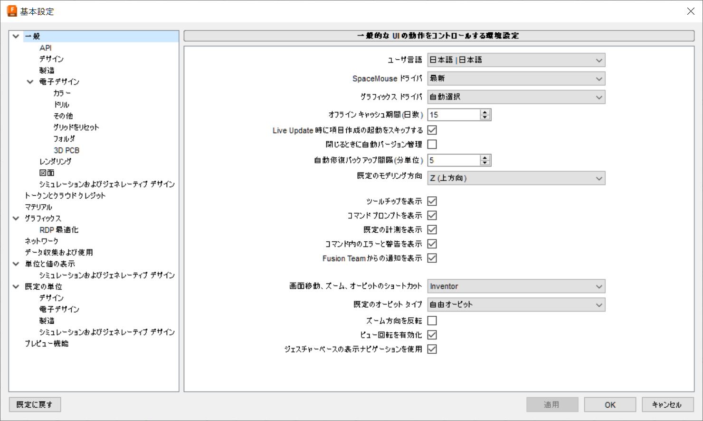
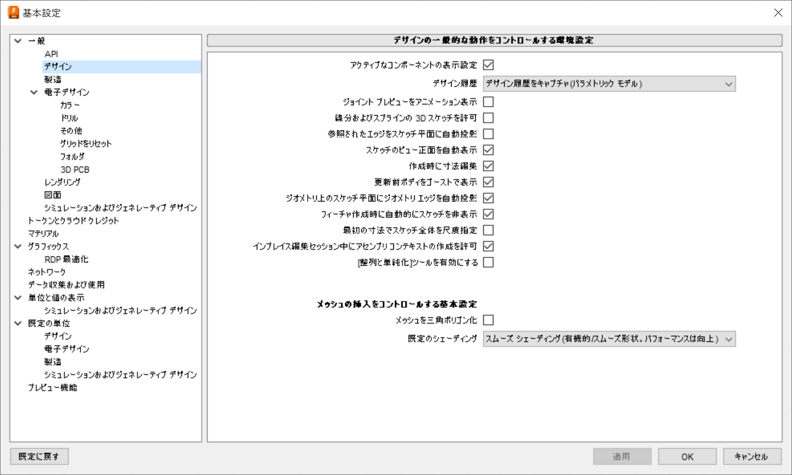
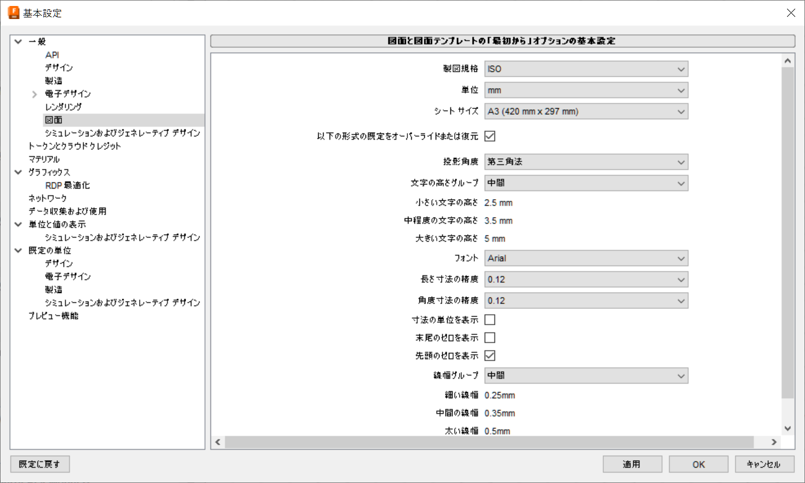
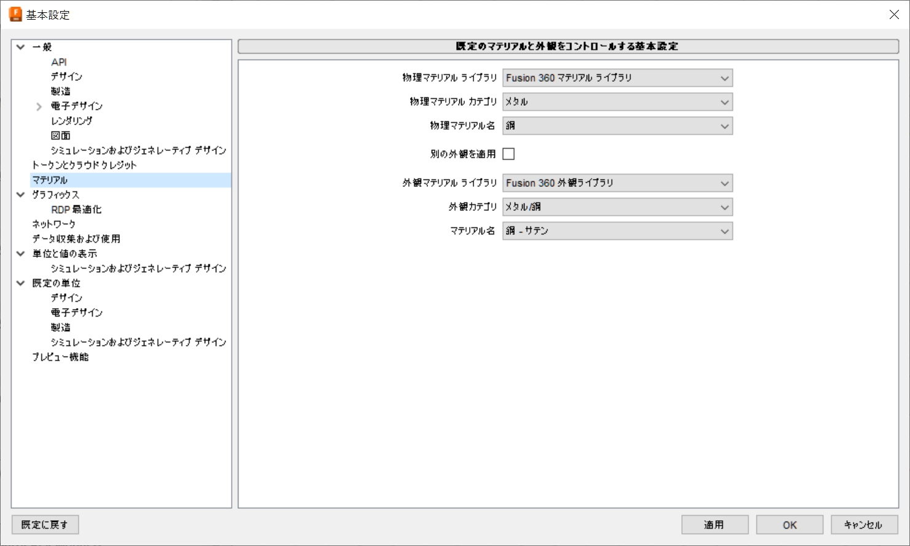

# 基本設定
設定は右上のアイコンをクリックして「基本設定」から行う。
## 一般
- 画面移動，ズーム...はもちろんInventor
- 既定のオービットタイプは自由オービット

## デザイン
- ジョイントプレビューをアニメーション表示はうざいので無効

## 図面
- とりあえず適当に画像のかんじに

## マテリアル
- デフォがキモイから変えたほうが良いけど，まだどれがいいか分かってない

