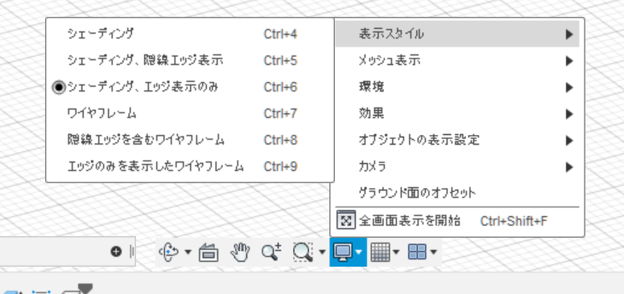
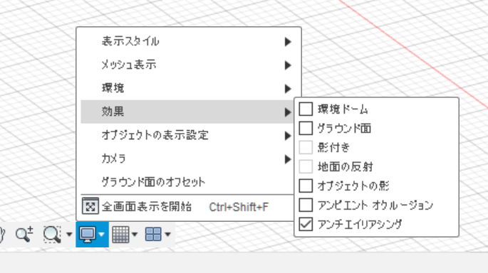
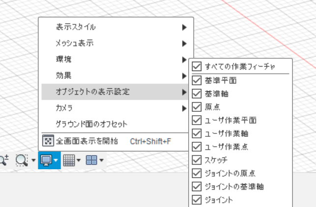
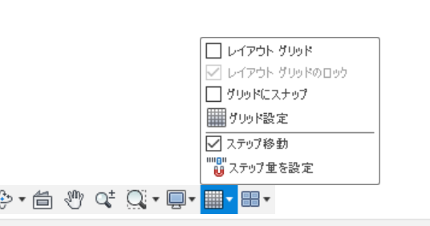

# 表示設定とグリッド
「表示設定」と「グリッドとスナップ」という設定項目は画面中央下から変更できる。Fusion特有のキモさをなるべく減らしていきたい。
## 表示設定
以下の三枚のように設定する。
ポイントとしては，エッジ表示することで物体の形を認識しやすくし，影などの表示を無くしてフラットに見えるようにしている。
アンチエイリアシングは有効にしていたほうが良いと思う。

## グリッド
「レイアウトグリッド」「グリッドにスナップ」共にいらないのでチェックを外す。
